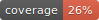

# ask-reddit

<div align="center">

[](https://github.com/ask-reddit/ask-reddit/actions?query=workflow%3Abuild)
[](https://pypi.org/project/ask-reddit/)
[](https://github.com/ask-reddit/ask-reddit/pulls?utf8=%E2%9C%93&q=is%3Apr%20author%3Aapp%2Fdependabot)

[](https://github.com/psf/black)
[](https://github.com/PyCQA/bandit)
[](https://github.com/ask-reddit/ask-reddit/blob/master/.pre-commit-config.yaml)
[](https://github.com/ask-reddit/ask-reddit/releases)
[](https://github.com/ask-reddit/ask-reddit/blob/master/LICENSE)


A Python scraper using PRAW to extract Reddit comments for NLP and GPT model analysis. This project aims to collect comprehensive comment data from Reddit threads.

</div>

# Ask Reddit Scraper

A command-line tool to scrape submissions from a specified subreddit, process the data, and save the output into batched JSON files.

---

## Prerequisites

-   **Conda:** This project is configured to use `conda` for environment management. You can install it via [Anaconda](https://www.anaconda.com/download) or [Miniconda](https://docs.conda.io/projects/miniconda/en/latest/).
-   **Reddit & Google API Credentials:** You will need API keys for both Reddit and any Google services you intend to use.

---

## Installation

Follow these steps to set up the project environment using `conda`.

**1. Clone the Repository**
```bash
git clone <your-repository-url>
cd ask_reddit
```

**2. Create and Activate the Conda Environment**
The repository includes an `environment.yml` file that contains all the necessary dependencies. Run the following command from your terminal to create the environment:

```bash
conda env create -f environment.yml
```

Once the process is complete, activate the new environment:

```bash
conda activate ask_reddit
```

**3. Configure Environment Variables**
Create a file named `.env` in the project's root directory. This file securely stores your API keys and configuration. Copy the following, paste it into the `.env` file, and add your credentials.

```ini
# .env file

# --- Reddit API Credentials ---
REDDIT_CLIENT_ID="YOUR_CLIENT_ID_HERE"
REDDIT_CLIENT_SECRET="YOUR_CLIENT_SECRET_HERE"
REDDIT_USER_AGENT="A_DESCRIPTIVE_USER_AGENT_STRING"
REDDIT_PASSWORD="YOUR_REDDIT_PASSWORD"

# --- Google Generative AI Configuration ---
GOOGLE_API_KEY="YOUR_GOOGLE_API_KEY_HERE"
GENAI_MODEL="gemini-2.5-flash"

# --- File & Data Configuration ---
FILE_LOCATION="data/"
SOURCE="reddit"
```

---

## Usage

Run the module from your terminal with the required arguments.

```bash
python -m ask_reddit --subreddit <name> --days <number> --batch <M|D>
```

### Arguments

-   `--subreddit`: **(Required)** The name of the subreddit to scrape (e.g., `python`).
-   `--days`: **(Required)** The number of days back from today to collect submissions.
-   `--batch`: **(Required)** The batching mode for output files (`D` for daily, `M` for monthly).

### Example

```bash
python -m ask_reddit --subreddit dataisbeautiful --days 30 --batch M
```

---

## Output

The script will generate JSON files inside the `data/` directory, which is created automatically if it does not exist.

-   **Daily Batching (`D`):** `r_subreddit_YYYY-MM-DD.json`
-   **Monthly Batching (`M`):** `r_subreddit_YYYY-MM.json`

## 🛡 License

[](https://github.com/ask-reddit/ask-reddit/blob/master/LICENSE)

This project is licensed under the terms of the `MIT` license. See [LICENSE](https://github.com/ask-reddit/ask-reddit/blob/master/LICENSE) for more details.

## 📃 Citation

```bibtex
@misc{ask-reddit,
  author = {john-james-ai},
  title = {A Python scraper using PRAW to extract Reddit comments for NLP and GPT model analysis. This project aims to collect comprehensive comment data from Reddit threads.},
  year = {2025},
  publisher = {GitHub},
  journal = {GitHub repository},
  howpublished = {\url{https://github.com/ask-reddit/ask-reddit}}
}
```
